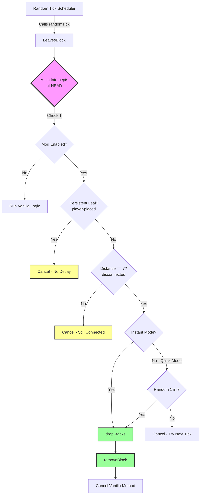
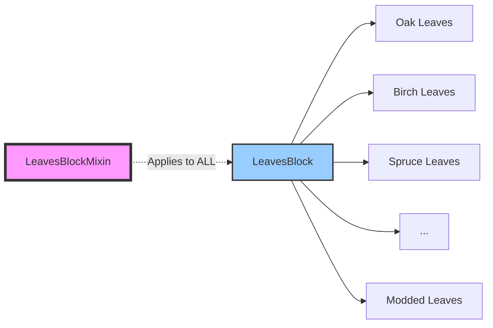

# Instant Leaf Decay - Flow Diagram

## System Architecture



## Performance Comparison

### Vanilla Minecraft
```
Log Broken → Distance Updates (multiple ticks) → Random Tick Delay → 
Decay Check → Timer Countdown (4-7 seconds) → More Random Ticks → 
Finally Remove Block
```
**Total Time**: ~4-7 seconds per leaf

### With Instant Leaf Decay
```
Log Broken → Distance Updates (same) → Random Tick → 
Mixin Checks Distance → Instant Remove
```
**Total Time**: 0.05-0.15 seconds per leaf (next random tick)

## Configuration Impact

| Config Setting | Behavior | Use Case |
|---------------|----------|----------|
| `enabled: false` | Vanilla decay (4-7 sec) | Disable mod without removing it |
| `enabled: true, instant: true` | Instant decay (1-2 ticks) | Fast tree clearing |
| `enabled: true, instant: false` | Quick decay (1-3 ticks) | Slightly more realistic |

## Mod Compatibility



All leaf types that extend `LeavesBlock` automatically work with this mod because the Mixin targets the parent class.

## Property Values

### PERSISTENT Property
- `true` = Player placed → **Protected from decay**
- `false` = Natural generation → **Can decay**

### DISTANCE Property
- `1-6` = Connected to log within 6 blocks → **No decay**
- `7` = Not connected to any log → **Should decay**

## Code Flow in LeavesBlockMixin.java

```java
@Inject(method = "randomTick", at = @At("HEAD"), cancellable = true)
private void onRandomTick(...) {
    // 1. Check configuration
    if (!config.enabled) return;           // Let vanilla run
    
    // 2. Check if player-placed
    if (state.get(PERSISTENT)) {
        ci.cancel();                        // Protect player leaves
        return;
    }
    
    // 3. Check connection to log
    int distance = state.get(DISTANCE);
    if (distance == 7) {
        // 4. Decay the leaf
        if (config.instant) {
            dropStacks(...);                // Generate loot
            removeBlock(...);               // Remove block
            ci.cancel();                    // Skip vanilla
        } else {
            // Quick mode: random chance
            if (random.nextInt(3) == 0) {
                dropStacks(...);
                removeBlock(...);
            }
            ci.cancel();                    // Always skip vanilla timer
        }
    } else {
        ci.cancel();                        // Still connected, no processing needed
    }
}
```

## Benefits Over Alternative Approaches

| Approach | Issues | This Mod's Solution |
|----------|--------|---------------------|
| Block Replacement | Breaks loot tables, no light updates | Uses vanilla dropStacks() |
| Scheduled Tick Hack | Complex, can cause lag spikes | Piggybacks on random ticks |
| Event Listener | Runs for ALL leaf interactions | Only processes decaying leaves |
| ASM CoreMod | Fragile, version-specific | Uses Fabric Mixin API |

